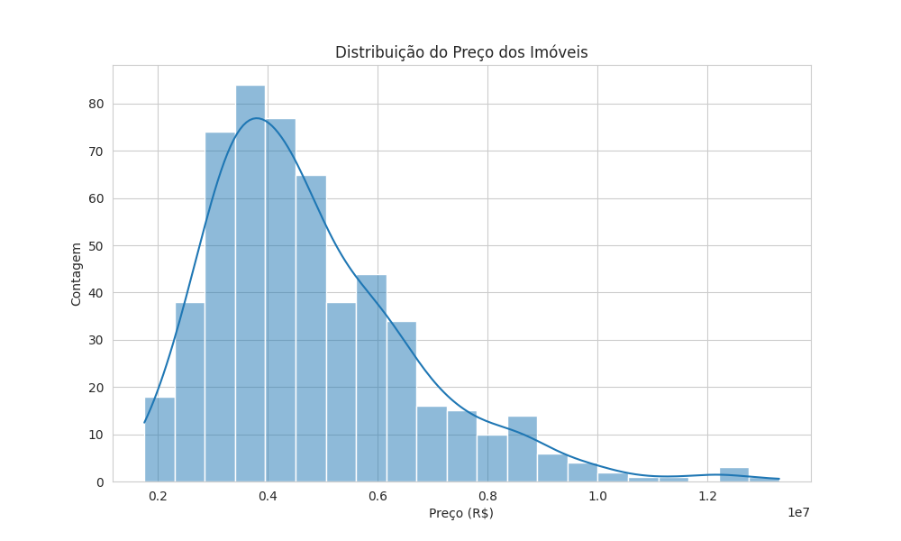
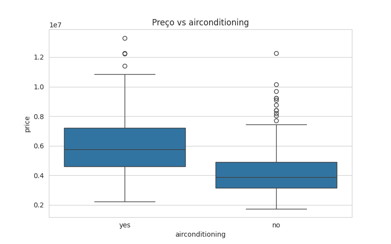
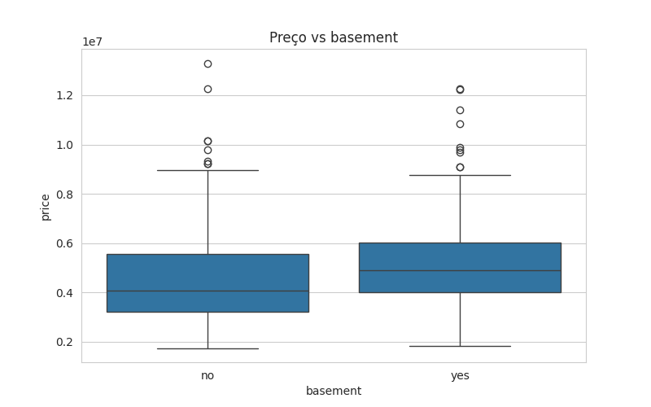
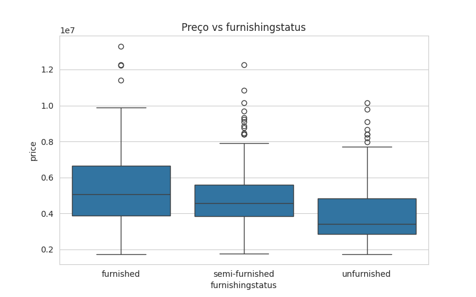

# Projeto Final de Ciência de Dados: Previsão de Preços de Imóveis

Este projeto demonstra o ciclo completo de um projeto de Ciência de Dados, desde a concepção do problema até a entrega de um modelo preditivo funcional, conforme os requisitos da Avaliação N3.

## Estrutura do Repositório

O repositório está organizado da seguinte forma:

```
.
├── README.md                   # Relatório detalhado do projeto
├── modelo_final.pkl            # Modelo treinado (Ridge Regression)
├── requirements.txt            # Dependências do projeto
├── distribuicao_preco.png      # Gráfico de distribuição da variável alvo
├── matriz_correlacao.png       # Matriz de correlação
├── boxplot_airconditioning.png # Gráfico de boxplot para airconditioning
├── boxplot_basement.png        # Gráfico de boxplot para basement
├── boxplot_furnishingstatus.png# Gráfico de boxplot para furnishingstatus
├── boxplot_guestroom.png       # Gráfico de boxplot para guestroom
├── boxplot_hotwaterheating.png # Gráfico de boxplot para hotwaterheating
├── boxplot_mainroad.png        # Gráfico de boxplot para mainroad
├── boxplot_prefarea.png        # Gráfico de boxplot para prefarea
├── data/
│   ├── Housing.csv             # Dataset original
│   └── processed_data.npz      # Dados pré-processados (X_train, X_test, y_train, y_test)
└── notebooks/
    ├── 01_EDA_e_Limpeza.ipynb  # Análise Exploratória de Dados e Limpeza
    ├── 02_Pre_processamento_e_Features.ipynb # Pré-processamento e Engenharia de Features
    └── 03_Modelagem_e_Avaliacao.ipynb # Treinamento, Avaliação e Comparação de Modelos
```

## Como Rodar o Projeto

1.  **Clonar o Repositório:**
2.  **Instalar Dependências:**
    ```bash
    pip install -r requirements.txt
    ```
3.  **Executar os Notebooks:** Os notebooks devem ser executados na ordem (01, 02, 03) para reproduzir o pipeline completo.

---

## Parte 1: A Fundação do Projeto - O Problema de Negócio

### 1.1. Domínio do Problema

O projeto se insere no contexto do **mercado imobiliário**, onde a precificação de imóveis é um desafio complexo e crucial para compradores, vendedores e agentes. A capacidade de estimar o valor de uma propriedade com base em suas características é fundamental para a tomada de decisões estratégicas e para garantir transações justas.

### 1.2. Pergunta de Negócio

A pergunta central que buscamos responder é:

> **"Quais características de um imóvel (como área, número de quartos, localização e amenidades) têm o maior impacto em seu preço de venda e como podemos prever esse preço com precisão?"**

### 1.3. Objetivo do Modelo

O objetivo principal foi construir um **modelo de regressão** capaz de estimar o preço de um imóvel com base em suas características. Este modelo serve como uma ferramenta de apoio para precificação, oferecendo uma estimativa de valor de mercado para novas propriedades.

---

## Parte 2: A Jornada dos Dados - Pipeline e Arquitetura

### 2.1. Origem e Repositório de Dados

*   **Fonte Original:** O dataset utilizado (`Housing.csv`) foi obtido no **Kaggle** [1], disponibilizado pelo usuário Yasser H.
*   **Arquitetura de Armazenamento:** Para este projeto de escopo limitado, a arquitetura adotada é a de um **Data Lake simples** (pasta `/data`), onde o arquivo CSV original é armazenado e os dados processados (`processed_data.npz`) são salvos para uso posterior. Esta escolha é justificada pela simplicidade e pelo volume reduzido de dados, garantindo a rastreabilidade e a separação entre dados brutos e tratados.

### 2.2. Pipeline de Dados

O fluxo de processamento seguiu as seguintes etapas:

| Etapa | Descrição | Justificativa |
| :--- | :--- | :--- |
| **Ingestão** | O dataset `Housing.csv` foi baixado via `kagglehub` e armazenado na pasta `/data`. | Garantir que o dado original esteja acessível e versionado. |
| **Limpeza e Transformação** | Verificação de valores ausentes (não foram encontrados) e tratamento de variáveis categóricas. | O dataset estava limpo em relação a valores nulos, mas as variáveis categóricas precisavam ser transformadas para serem usadas em modelos de ML. |
| **Análise Exploratória (EDA)** | Análise da distribuição da variável alvo (`price`), correlação entre variáveis numéricas e boxplots de preço por categoria. | A EDA (Notebook `01_EDA_e_Limpeza.ipynb`) confirmou que a variável `area` é a mais correlacionada com o preço. As variáveis categóricas como `mainroad`, `guestroom`, `basement`, `hotwaterheating`, `airconditioning` e `furnishingstatus` mostraram impacto significativo no preço. |
| **Preparação para Modelagem** | **Codificação:** Uso de **One-Hot Encoding** (`pd.get_dummies` com `drop_first=True`) para transformar variáveis categóricas em numéricas. **Escalonamento:** Uso de **MinMaxScaler** nas variáveis preditoras (`X`) para normalizar a escala dos dados. **Divisão:** Separação dos dados em conjuntos de treino (70%) e teste (30%) com `random_state=42`. | O One-Hot Encoding é necessário para modelos lineares. O escalonamento é crucial para modelos baseados em distância e para evitar que features com grandes magnitudes dominem o treinamento. A divisão garante uma avaliação imparcial do modelo. |

### Visualização da EDA

#### Distribuição da Variável Alvo (`price`)

A distribuição do preço dos imóveis é ligeiramente inclinada à direita, o que é comum em dados de mercado imobiliário.



#### Matriz de Correlação

A matriz de correlação mostra a relação entre as variáveis numéricas. Nota-se que `area`, `bathrooms` e `stories` são as variáveis mais correlacionadas com o preço.


#### Boxplots de Variáveis Categóricas vs. Preço

Os boxplots mostram a diferença na mediana de preço para as categorias de variáveis binárias e nominais, indicando que elas são importantes preditores.

| Variável | Gráfico |
| :--- | :--- |
| `airconditioning` |  |
| `basement` |  |
| `furnishingstatus` |  |
| `guestroom` |  |
| `hotwaterheating` |  |
| `mainroad` |  |
| `prefarea` |  |

---

## Parte 3: O Coração do Projeto - Modelagem e Avaliação Comparativa

### 3.1. Treinamento de Três Modelos

Foram escolhidos três algoritmos de regressão, conforme sugerido na avaliação:

1.  **Regressão Linear (`LinearRegression`)**: Modelo base, simples e interpretável.
2.  **Regressão Ridge (`Ridge`)**: Uma forma de Regressão Linear com regularização L2, útil para lidar com multicolinearidade e evitar overfitting.
3.  **Árvore de Decisão para Regressão (`DecisionTreeRegressor`)**: Um modelo não-linear que pode capturar relações complexas nos dados.

### 3.2. Avaliação com Três Métricas

As seguintes métricas de desempenho foram escolhidas para avaliar os modelos de regressão:

| Métrica | Explicação | Relevância para o Problema |
| :--- | :--- | :--- |
| **R² (R-squared)** | Coeficiente de Determinação. Mede a proporção da variância na variável dependente que é previsível a partir das variáveis independentes. Um valor mais próximo de 1 indica um melhor ajuste. | É a métrica principal para entender o poder explicativo geral do modelo. |
| **MAE (Mean Absolute Error)** | Erro Absoluto Médio. É a média da magnitude dos erros em um conjunto de previsões, sem considerar a direção. É robusto a *outliers*. | Representa o erro médio absoluto das previsões em termos monetários (R$). É fácil de interpretar. |
| **RMSE (Root Mean Squared Error)** | Raiz do Erro Quadrático Médio. É a raiz quadrada da média dos erros quadráticos. Penaliza erros maiores de forma mais severa que o MAE. | É a métrica mais comum para regressão e é útil quando erros grandes são particularmente indesejáveis. |

### 3.3. Análise Comparativa dos Resultados

Os modelos foram treinados e avaliados no conjunto de teste. Os resultados são apresentados na tabela abaixo:

| Modelo | R² (R-squared) | MAE (Mean Absolute Error) | RMSE (Root Mean Squared Error) |
| :--- | :--- | :--- | :--- |
| **Ridge** | **0.6500** | **911,388.00** | **1,227,720.00** |
| Regressão Linear | 0.6463 | 920,393.00 | 1,234,110.00 |
| Árvore de Decisão | 0.1752 | 1,259,510.00 | 1,884,610.00 |

**Discussão dos Resultados:**

*   O modelo **Ridge** obteve o melhor desempenho em todas as três métricas, com um R² de aproximadamente 0.65. Isso significa que o modelo consegue explicar cerca de 65% da variância nos preços dos imóveis.
*   A **Regressão Linear** teve um desempenho muito próximo, o que é esperado, já que o Ridge é uma variação regularizada da Regressão Linear. A pequena melhora do Ridge sugere que a regularização L2 ajudou a estabilizar o modelo, possivelmente mitigando o efeito da multicolinearidade.
*   A **Árvore de Decisão** teve o pior desempenho, indicando que, sem um ajuste fino de hiperparâmetros, ela não conseguiu generalizar bem as relações lineares e não-lineares presentes no dataset.

**Modelo Escolhido:**

O modelo escolhido é a **Regressão Ridge**. Ele oferece o melhor equilíbrio entre poder preditivo (maior R²) e robustez, sendo ligeiramente superior à Regressão Linear simples.

---

## Parte 4: Tornando o Modelo Útil - Deploy

### 4.1. Salvando o Modelo Treinado

O modelo **Ridge** (o melhor modelo) foi salvo em um arquivo binário usando a biblioteca `joblib` para que possa ser carregado e utilizado em um ambiente de produção sem a necessidade de retreinamento.

```python
import joblib
# ... (código de treinamento)
joblib.dump(best_model, 'modelo_final.pkl')
```

O arquivo `modelo_final.pkl` está na raiz do projeto.

### 4.2. Carregando e Utilizando o Modelo

A demonstração de uso foi realizada no Notebook `03_Modelagem_e_Avaliacao.ipynb`, onde o modelo salvo foi carregado e utilizado para fazer uma previsão em uma amostra do conjunto de teste.

**Exemplo de Previsão:**

1.  **Carregamento do Modelo:**
    ```python
    loaded_model = joblib.load('modelo_final.pkl')
    ```
2.  **Previsão para uma Amostra:**
    *   **Valor Real (Amostra de Teste):** R$ 4,060,000.00
    *   **Previsão do Modelo Ridge:** R$ 5,243,188.66

**Explicação:**

O modelo carregado previu um preço de R$ 5.243.188,66 para o imóvel com as características da amostra. O erro de R$ 1.183.188,66 (diferença entre o valor real e o previsto) está dentro da margem de erro (RMSE) do modelo, demonstrando que o modelo está funcional e pronto para ser integrado a uma aplicação que necessite de previsões de preço de imóveis.

---

## Referências

[1] Housing Prices Dataset. Kaggle. Disponível em: https://www.kaggle.com/datasets/yasserh/housing-prices-dataset.